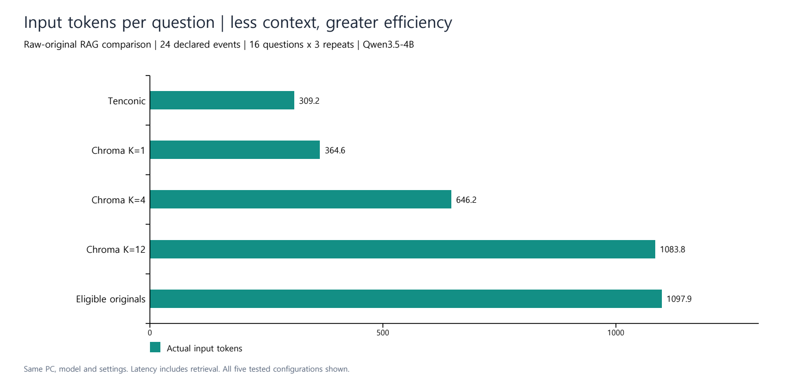
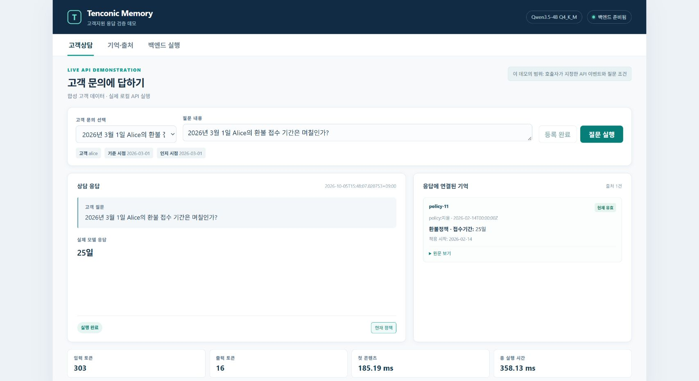
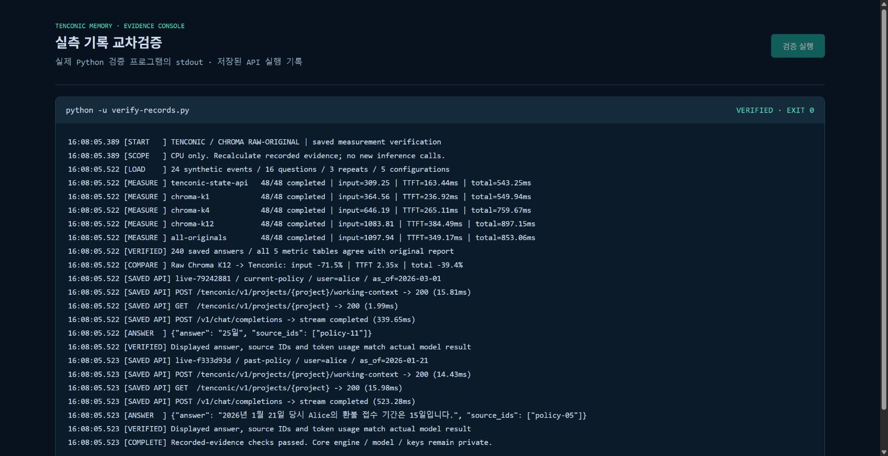

# Tenconic Memory: Less Context, Faster Answers

**Measured locally on the same model, machine and customer-support workload.**

Tenconic selected the effective memory state before answer generation. In this policy-history experiment, it reduced the amount of context the answer model had to read and delivered faster responses than the raw-document Chroma RAG K=12 baseline.

| Metric | Tenconic | Chroma RAG K=12 | Measured advantage |
|---|---:|---:|---:|
| Input tokens per question | **309.25** | 1,083.81 | **71.5% fewer** |
| Time to first answer content | **163.44 ms** | 384.49 ms | **2.35x faster** |
| Time to completed answer | **543.25 ms** | 897.15 ms | **39.4% shorter** |
| Reviewed answer and source correctness | **15/16 questions** | 14/16 questions | **93.75% vs 87.50%** |

The trial used 24 synthetic customer-support records, 16 distinct questions and three repeats per question. All five configurations completed: **240 actual answer calls**. The answer model was Qwen3.5-4B Q4_K_M. Measurements were recorded on **5 October 2026**.

## Why this workload matters

Customer support needs the policy that applied to a particular customer at a particular time. Keeping a document history alone leaves that interpretation to the answer model. Tenconic preserves the history and supplies the requested effective state, reducing repeated history interpretation in the prompt.

The observed benefit is **less context with maintained answer quality**, rather than a claim that removing information automatically makes an answer better.

## Actual operation

The screenshots below show actual local Tenconic API and model execution with synthetic customer data. The current-policy query returned **25 days**; a historical query returned **15 days**, with different source records.

[Original source and metadata](tenconic-memory-sources-20261005.jpg) · [Backend API execution](tenconic-backend-live-20261005.jpg) · [Historical answer](tenconic-customer-support-past-20261005.jpg)

The terminal view displays real verification-program output: recalculation of saved measurements and checks against recorded API/model results. It is a verification run, not a new inference run.

## Inspect the evidence

- [Measurement protocol](PROTOCOL.md): shared inputs, settings and metric definitions.
- [Results across all five configurations](RESULTS.md): K=1, K=4, K=12 and the eligible-originals control.
- [Verification guide](VERIFICATION.md): inspect records and independently recalculate the published figures.
- [Recorded measurement package](measurement-records.zip): fixture, questions, expected answers, actual requests, responses, timings and review labels.

This repository publishes **evidence only**. It contains no Tenconic source code, executable, model weights, credentials, private ledger or internal runtime configuration. Public records support inspection and numerical cross-checking; running the private engine requires separate engine access.

Documentation is in English. The original Korean fixture, prompts and answers are preserved unchanged in the records. These results describe the specified raw-document RAG workload and runtime; the percentages are not model-independent guarantees.
