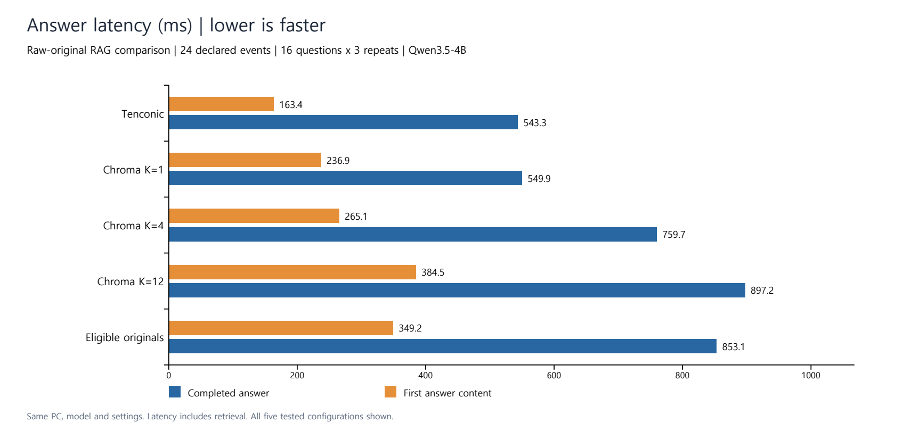
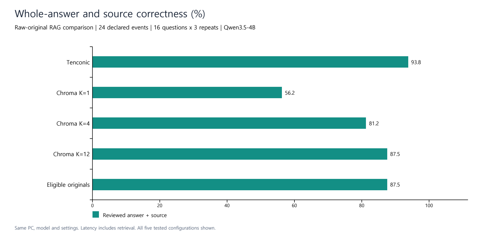

# Recorded Results

Same data, answer model, generation settings and machine. Each configuration has 16 questions x 3 repeats: 48 completed calls, with no failed calls in the primary experiment.

| Configuration | Mean input tokens | First answer content (ms) | Completed answer (ms) | Whole-answer and source review |
|---|---:|---:|---:|---:|
| **Tenconic state API** | **309.25** | **163.44** | **543.25** | **15/16 (93.75%)** |
| Chroma K=1 | 364.56 | 236.92 | 549.94 | 9/16 (56.25%) |
| Chroma K=4 | 646.19 | 265.11 | 759.67 | 13/16 (81.25%) |
| Chroma K=12 | 1,083.81 | 384.49 | 897.15 | 14/16 (87.50%) |
| Eligible originals | 1,097.94 | 349.17 | 853.06 | 14/16 (87.50%) |

Timing values are averages of per-question three-repeat medians. Token values use actual usage averages. Whole-answer review was consistent across the three repeats for each question; the 48-call pass counts are respectively 45, 27, 39, 42 and 42.

## Main comparison: raw Chroma K=12 to Tenconic

- **71.5% fewer input tokens:** `1 - 309.25 / 1083.8125`.
- **2.35x faster first answer content:** `384.489956 / 163.444781`.
- **39.4% shorter completion time:** `1 - 543.253363 / 897.151287`.
- **15/16 vs 14/16 reviewed questions** with the same answer model.

The full K sweep shows the accuracy/context tradeoff. Tenconic combined the smallest measured input with the highest reviewed correctness in this recorded workload.

## Traceability

The primary run is `full-20261005T052656Z-17a59900`. Its 240 calls, expected metric table and per-call review labels are included in [measurement-records.zip](measurement-records.zip). The two customer-support screenshots are separate demonstrations; their individual timings are not included in the benchmark averages.

Numerical recalculation on 5 October 2026 matched all five original metric tables. This verifies consistency of the exported records and report, not third-party certification.
